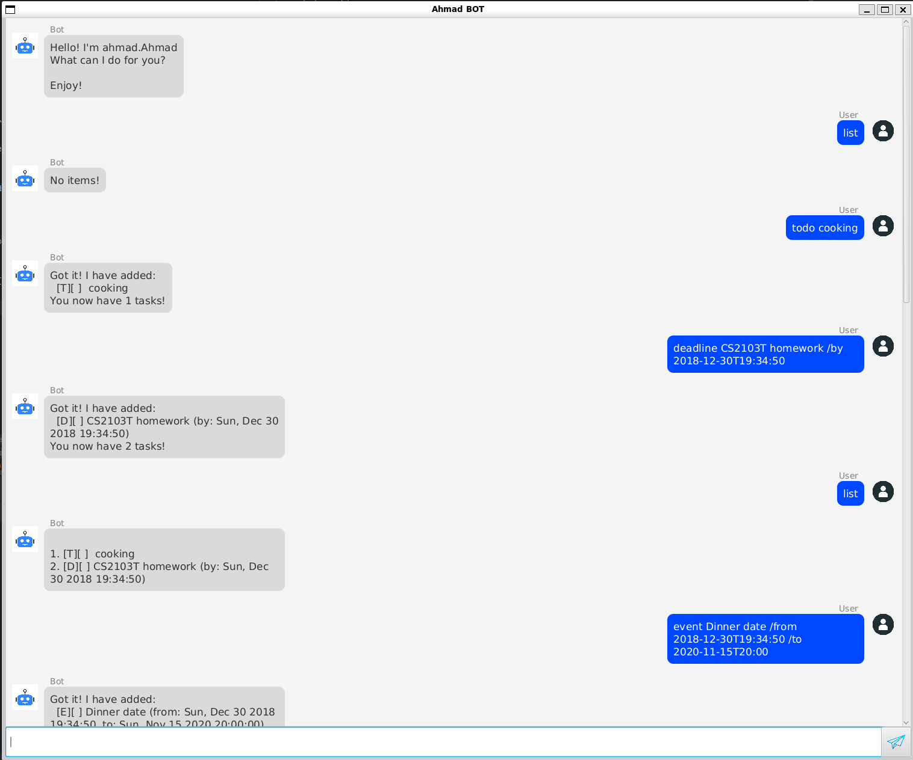

# Ahmad User Guide

**Ahmad** is your personal chatbot designed to help you manage tasks efficiently.
With Ahmad, you can easily add to-dos, deadlines, and events, and mark them as complete when finished.
Ahmad keeps track of your tasks even after the program is closed.
You can also list, sort, and filter your tasks to suit your needs, making task management a breeze!

## Adding Tasks

### To-dos

`todo [name]`

Adds an unmarked todo task to the task list.

Example: `todo Eat Dario's Pizza`

### Deadline

`deadline [name] /by [deadline-date]`
Dates are in the format of: `YYYY`-`MM`-`DD`T`HH`:`MM`:`SS`.

Adds an unmarked task with deadline at `[deadline-date]` to the task list.

Example: `deadline 3 homework /by 2022-12-30T19:34:50`

### Event

`event [name] /from [from-date] /to [to-date]`

`/from` and `/to` are interchangeable.
Dates are in the format of: `YYYY`-`MM`-`DD`T`HH`:`MM`:`SS`.

Adds an unmarked event from `[from-date]` to `[to-date]`to the task list.

Example: `event Dinner date /to 2020-11-15T20:00 /from 2018-12-30T19:34:50`

## Listing Tasks

`list ...[args]`

Optional arguments:

1. `todo`: Filters todo tasks.
2. `deadline`: Filters deadline tasks.
3. `event`: Filters event tasks.
4. `sorted`: Sorts the task based on their time in ascending order.

Lists all the tasks based on the arguments given.

Example: `list sorted`, `list deadline`, `list event sorted`

## Marking Tasks

`mark [task-number]`

Marks the `[task-number]` as done.

Example: `mark 21`

## Unmarking Tasks

`unmark [task-number]`

Marks the `[task-number]` as **not** done.

Example: `unmark 21`

## Deleting Tasks

`delete [task-number]`

Deletes the `[task-number]` from the task list.

Example: `delete 12`

## Exiting the application

`bye`

Exits the application.
